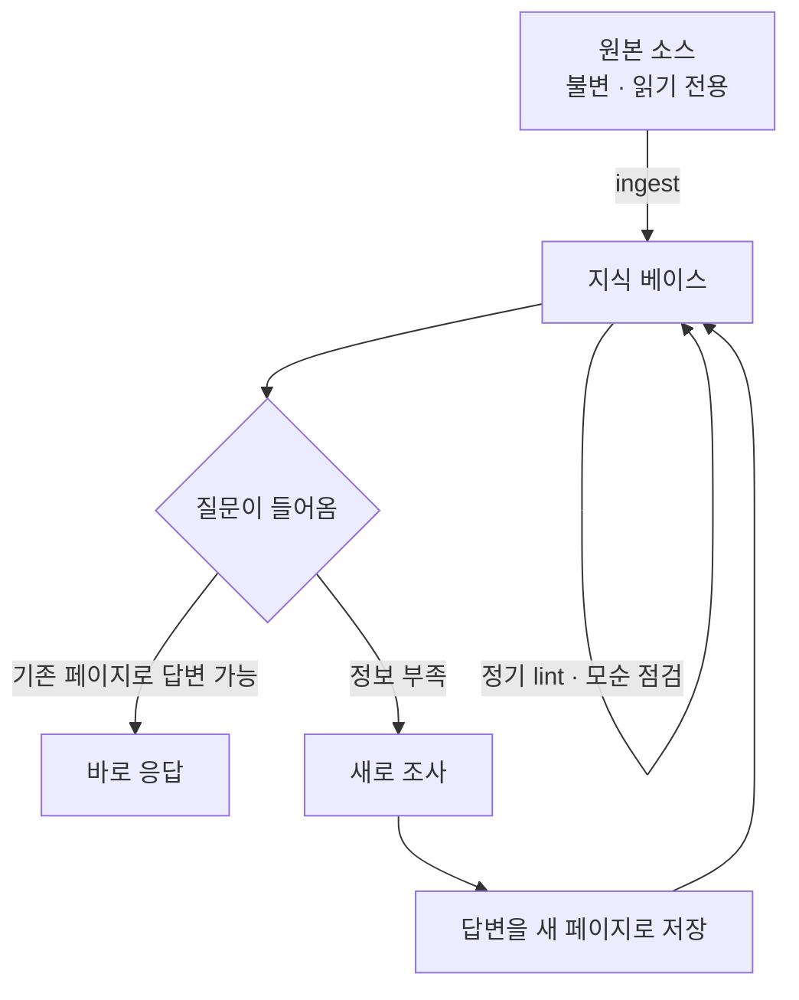
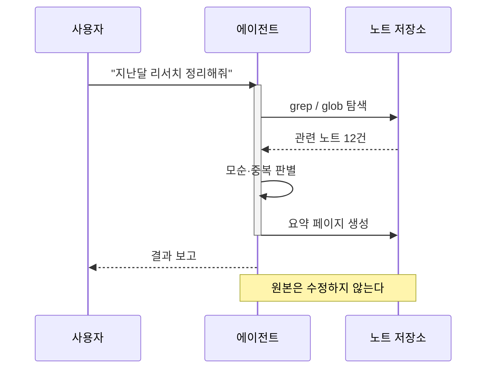
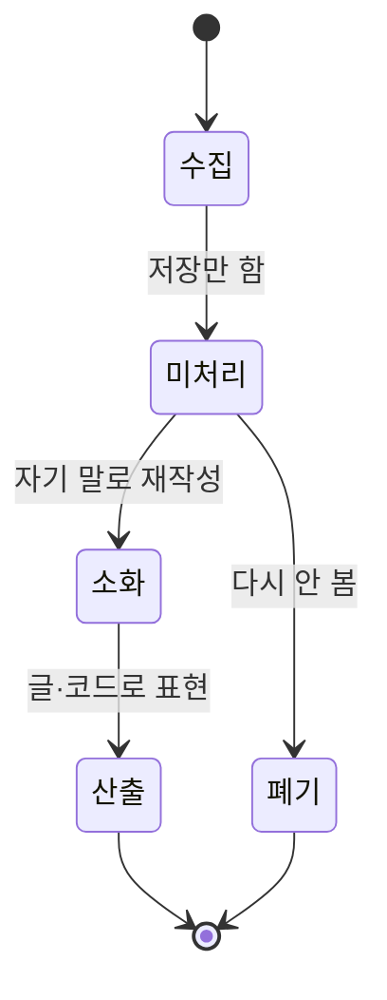
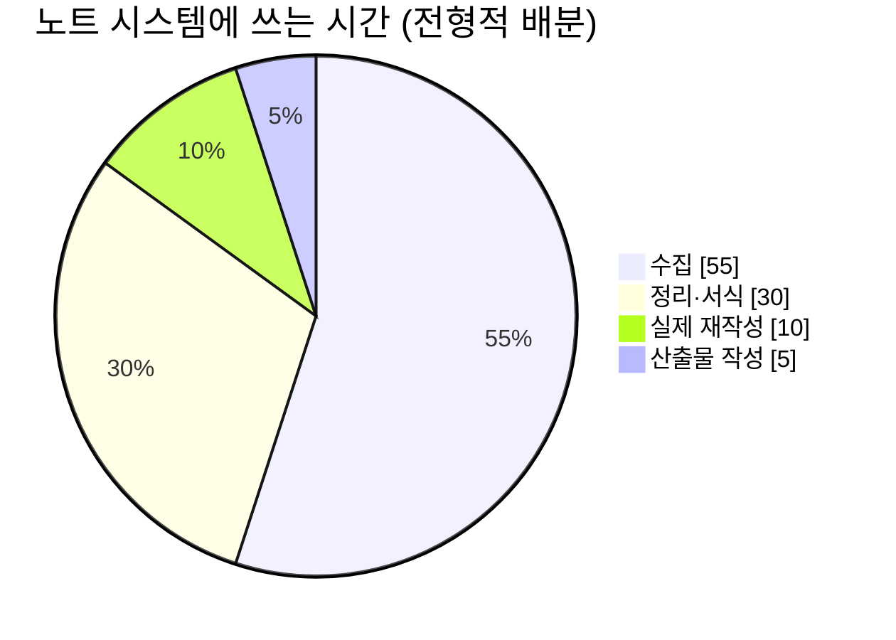
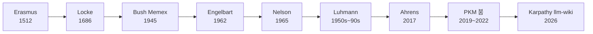

이 글은 블로그에 Mermaid 렌더링을 붙인 뒤 실제로 동작하는지 확인하기 위한 테스트다. 확인 항목은 넷이다.

1. 여러 다이어그램 유형이 모두 그려지는가
2. 일반 코드블록이 영향을 받지 않는가
3. 한글 라벨이 깨지지 않는가
4. 다크/라이트 테마를 전환하면 다이어그램 색도 따라오는가

---

## 1. Flowchart — 기본 흐름도

가장 많이 쓰는 형태다. 노드 라벨에 한글과 `<br/>` 줄바꿈을 함께 넣었다.



---

## 2. Sequence Diagram — 시퀀스

화살표 종류와 활성화 박스, 노트를 함께 확인한다.



---

## 3. State Diagram — 상태도



---

## 4. Pie Chart — 파이



---

## 5. 일반 코드블록은 그대로 남아야 한다

아래 두 블록은 Mermaid가 **아니므로** 평범한 코드블록으로 보여야 한다. 하이라이팅도 유지되어야 한다.

```python
def collect(note):
    """수집은 이해가 아니다."""
    if not note.rewritten_in_own_words:
        return "collector's fallacy"
    return note
```

```bash
obsidian search:context "zettelkasten" --limit 20
obsidian orphans
```

인라인 코드도 확인한다 — `flowchart TD`라고 써도 다이어그램으로 바뀌면 안 된다.

---

## 6. 넓은 다이어그램 — 가로 스크롤 확인

모바일에서 잘리지 않고 가로 스크롤이 걸리는지 본다.



---

## 확인 결과

- [ ] 1~4번 다이어그램이 모두 그려진다
- [ ] 5번의 코드블록은 코드로 남아 있다
- [ ] 한글 라벨이 깨지지 않는다
- [ ] 우측 상단 토글로 테마를 바꾸면 다이어그램 색이 함께 바뀐다
- [ ] 6번 다이어그램이 화면을 넘지 않는다

문제가 없으면 이 포스트는 지워도 된다.
