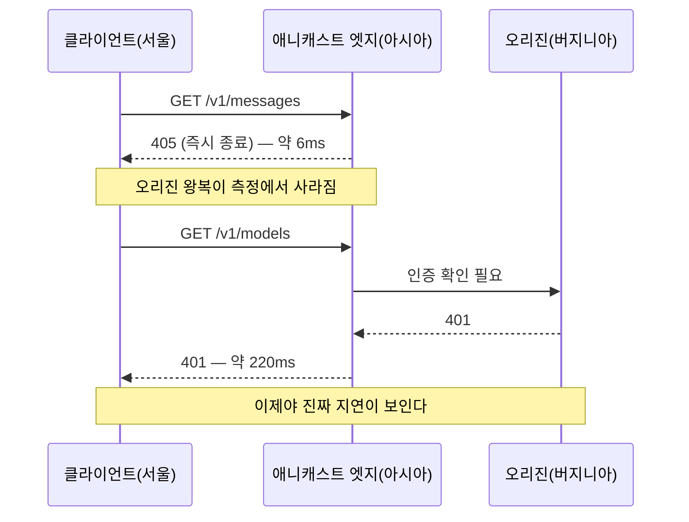
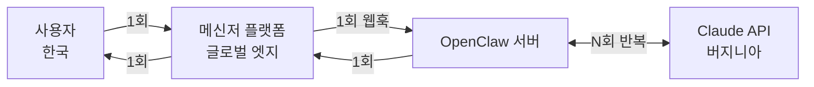

> 이 글은 오라클 클라우드에 개인 에이전트를 올릴 리전을 고르는 과정에서, AI 에이전트(Aside · Claude)와 주고받은 측정과 논쟁을 정리한 기록입니다. 본문의 지연 수치는 모두 실제로 측정한 값이고, 2장의 "내가 냈던 결론"은 그 대화에서 처음 도달했다가 3장에서 뒤집힌 1차 결론을 가리킵니다.

## TL;DR

- `api.anthropic.com`은 **애니캐스트**다. 서울에서 TCP 연결이 37ms에 붙는다고 해서 서버가 가까이 있는 게 아니다.
- **실제 추론 오리진은 미국 동부(버지니아)** 에 있다. 측정으로 확인했다.
- `GET /v1/messages`처럼 **엣지가 405로 끊어버리는 요청으로 재면 오리진 왕복이 안 잡힌다.** 인증이 필요한 엔드포인트(401)로 재야 한다.
- 한국 ↔ 미국 동부 오리진 왕복 차이는 **턴당 약 180ms**.
- 단발 호출이면 무시해도 되지만, **에이전트 루프는 이게 턴 수만큼 곱해진다.** 30턴이면 5.4초, 100턴이면 18초.
- 반면 최종 사용자 쪽 지연은 **메시지당 2회**만 발생하고 곱해지지 않는다.
- 결론: OpenClaw처럼 툴 호출을 반복하는 워크로드는 **미국 동부에 두는 게 유리**하다. 단, 국내 사이트 브라우저 자동화 비중이 크면 뒤집힌다.

---

## 1. 발단: 프리티어 서버를 어느 리전에 둘까

오라클 클라우드 Always Free 인스턴스에 OpenClaw를 올려 Claude Opus로 굴릴 계획이었다. (프리티어 자체를 처음 시작한다면 [오라클 클라우드 프리티어 실전 시리즈](/dev/2026/08/27/2026년-오라클-클라우드-프리티어-조용히-반토막-났다/)를 먼저 보면 된다.) 오라클 프리티어는 **홈 리전을 한 번 정하면 사실상 못 바꾼다.** 그래서 처음에 제대로 골라야 한다.

직관적으로는 이렇게 생각했다.

> 최종 사용자가 한국에 있으니 서울 리전. 끝.

그런데 정말 그럴까 싶어서 재보기로 했다.

---

## 2. 1차 측정과, 내가 냈던 틀린 결론

먼저 로컬(서울)에서 `curl`로 타이밍을 분해했다.

```bash
curl -s -o /dev/null \
  -w "dns:%{time_namelookup} tcp:%{time_connect} tls:%{time_appconnect} ttfb:%{time_starttransfer} ip:%{remote_ip}\n" \
  -X POST https://api.anthropic.com/v1/messages \
  -H "content-type: application/json" -d '{}'
```

결과:

```
dns:0.0030  tcp:0.0371  tls:0.0754  ttfb:0.3052  ip:160.79.104.10
```

IP를 조회해 봤다.

```json
{
  "ip": "160.79.104.10",
  "city": "San Francisco",
  "org": "AS399358 Anthropic, PBC",
  "anycast": true
}
```

**Anthropic 자체 ASN이고 애니캐스트다.** 등록지는 샌프란시스코인데, 서울에서 TCP가 37ms에 붙는다. 같은 시점 비교군을 보면 이게 얼마나 가까운지 알 수 있다.

| 엔드포인트 | TCP connect |
|---|---|
| `ec2.ap-northeast-2` (서울) | 14ms |
| **`api.anthropic.com`** | **37ms** |
| `ec2.ap-northeast-1` (도쿄) | 48ms |
| `ec2.us-west-2` (오리건) | 138ms |
| `ec2.us-east-1` (버지니아) | 197ms |

도쿄보다도 가깝다. 접속 지점은 확실히 아시아권이다.

그런데 TTFB는 305ms다. TLS까지가 75ms니까 나머지 230ms는 엣지 너머에서 쓰인 것이다. 서울↔미국 왕복과 얼추 맞는다.

여기서 나는 이렇게 결론 냈다.

> 미국 왕복 구간은 어느 아시아 리전에 두든 똑같이 발생한다. 서울이든 도쿄든 차이는 10ms 수준. **그러니 리전은 Claude 기준으로 고민할 문제가 아니다.** 사용자 위치 기준으로 서울을 고르면 된다.

**이게 틀렸다.**

---

## 3. 반론: 에이전트는 한 번만 왕복하지 않는다

받은 지적은 이랬다.

> OpenClaw가 Claude Opus와 자기들끼리 티키타카를 수십 번 할 수도 있다. 최종 사용자가 한국에 있어도, OpenClaw가 Claude 서버와 가까이 있으면 이점이 생기는 것 아닌가?

맞는 말이다. 내 계산에는 **"사용자 요청 1건 = Claude 호출 1회"** 라는 전제가 암묵적으로 깔려 있었다. 일반적인 웹 서비스라면 맞지만, 에이전트는 다르다.

에이전트 루프는 이렇게 돈다.

1. 사용자 메시지 수신
2. Claude 호출 → 툴 호출 요청 반환
3. 툴 실행 (파일 읽기, 셸 명령, 웹 검색…)
4. 결과를 붙여서 **Claude 재호출**
5. 2~4를 목표 달성까지 반복
6. 최종 응답 발송

**2~4가 수십 번 돈다.** 매 반복이 서버↔Claude 왕복 한 번이다. 반면 1번과 6번, 즉 사용자 쪽 왕복은 세션당 딱 두 번이다.

즉 **서버→Claude 지연은 N배로 곱해지고, 사용자→서버 지연은 안 곱해진다.** 전제가 완전히 달라진다.

다시 측정하기로 했다.

---

## 4. 그런데 측정 방법 자체가 틀려 있었다

지역별로 재기 위해 [Globalping](https://globalping.io) API를 썼다. 전 세계 프로브에서 HTTP 타이밍을 재주는 무료 서비스다.

```bash
curl -s -X POST "https://api.globalping.io/v1/measurements" \
  -H "content-type: application/json" \
  -d '{"type":"http","target":"api.anthropic.com",
       "locations":[{"country":"KR","limit":2},{"country":"JP","limit":2},
                    {"country":"US","state":"CA","limit":2},{"country":"US","state":"VA","limit":2}],
       "measurementOptions":{"protocol":"HTTPS",
                             "request":{"method":"GET","path":"/v1/messages"}}}'
```

결과가 이상했다.

| 프로브 | TCP | TLS 누적 | firstByte | code |
|---|---|---|---|---|
| Tokyo, JP | 1ms | 5ms | **5ms** | 405 |
| Ashburn, VA | 1ms | 5ms | **6ms** | 405 |
| Chuncheon, KR | 4ms | 9ms | **6ms** | 405 |
| Seoul, KR | 35ms | 41ms | **39ms** | 405 |

**전 지역이 한 자릿수 ms다.** 서울이든 버지니아든 똑같다. 이대로면 "리전 무관"이 맞는 것처럼 보인다.

하지만 상태 코드를 보자. **전부 405 Method Not Allowed.** `/v1/messages`는 POST 전용이라, GET으로 때리면 **엣지가 오리진까지 가지도 않고 그 자리에서 거절**한다.

즉 이 측정은 **"가장 가까운 애니캐스트 엣지까지의 거리"만 잰 것**이지, 실제 API 처리 지연을 잰 게 아니다. 1차 측정에서 내가 본 37ms도 정확히 같은 함정이었다.

> **교훈:** 애니캐스트 뒤에 있는 API를 잴 때, **엣지에서 종료되는 응답(405, 404, 400, OPTIONS 등)으로 재면 오리진 왕복이 통째로 사라진다.** 숫자가 이상하게 좋으면 상태 코드부터 봐야 한다.

---

## 5. 오리진까지 가는 경로 찾기

오리진을 반드시 거치는 요청이 필요했다. **인증 검사**는 오리진에서 하므로, 키 없이 인증 필요 엔드포인트를 치면 된다.

로컬에서 경로별로 비교해 봤다.

```bash
for p in /v1/messages /v1/models /v1/organizations/me; do
  curl -s -o /dev/null \
    -w "$p  code:%{http_code} tls:%{time_appconnect} ttfb:%{time_starttransfer}\n" \
    "https://api.anthropic.com$p" -H "anthropic-version: 2023-06-01"
done
```

```
/v1/messages          code:405  tls:0.0835  ttfb:0.1239   ← 엣지 종료
/v1/models            code:401  tls:0.0840  ttfb:0.3256   ← 오리진 도달
/v1/organizations/me  code:401  tls:0.0712  ttfb:0.2856   ← 오리진 도달
```

명확하다. **405는 124ms, 401은 326ms.** 200ms 차이가 곧 미국 왕복이다.

`GET /v1/models`를 측정 경로로 확정했다. 인증만 실패시키므로 토큰도 안 쓰고 과금도 없다.



---

## 6. 지역별 실측 결과

같은 Globalping 요청에서 경로만 `/v1/models`로 바꿨다.

| 프로브 위치 | TCP | TLS 누적 | **오리진 왕복** | 총 TTFB |
|---|---|---|---|---|
| **Ashburn, VA** | 1ms | 5ms | **27ms** | 32ms |
| Manassas, VA | 3ms | 6ms | **29ms** | 35ms |
| Hillsboro, OR | 1ms | 6ms | 77ms | 83ms |
| San Jose, CA | 1ms | 7ms | 77ms | 84ms |
| Los Angeles, CA | 3ms | 9ms | 100ms | 109ms |
| Falkenstein, DE | 6ms | 18ms | 129ms | 147ms |
| **Tokyo, JP** | 2ms | 14ms | **159ms** | 173ms |
| Chiba, JP | 2ms | 40ms | 159ms | 199ms |
| **Seoul, KR** | 37ms | 179ms* | **206ms** | 385ms |
| Chuncheon, KR | 4ms | 9ms | 216ms | 225ms |
| Singapore, SG | 35ms | 38ms | 233ms | 271ms |

<small>* 서울 프로브의 TLS 179ms는 다른 한국 프로브(춘천 9ms) 대비 혼자 튀는 값이라 해당 프로브 네트워크 문제로 보인다. 오리진 왕복(206ms)은 춘천(216ms)과 일관된다.</small>

### 읽어야 할 것

**1. 오리진은 미국 동부다.** Ashburn 27ms, Manassas 29ms로 압도적으로 낮고, 서쪽으로 갈수록 계단식으로 늘어난다(오리건·산호세 77ms → LA 100ms). 버지니아 권역에 추론 인프라가 있다고 보는 게 자연스럽다.

**2. 한국 ↔ 미국 동부 = 약 180ms 차이.** (206ms − 27ms)

**3. 도쿄는 한국보다 50ms 낫다.** 아시아 안에서도 차이가 있다. "아시아면 다 비슷"은 정확하지 않았다.

**4. 내 1차 결론은 절반만 맞았다.** "아시아 리전끼리는 비슷하다"는 맞았지만, "그래서 리전이 안 중요하다"는 틀렸다. 비교 대상에 **미국을 넣지 않은 게** 오류였다.

---

## 7. 에이전트 루프에서의 누적

턴당 180ms가 몇 번 곱해지는지 계산해 보자.

| 턴 수 | Seoul | Tokyo | **Ashburn** | Seoul → Ashburn 절감 |
|---|---|---|---|---|
| 10턴 | 2.1s | 1.6s | 0.3s | **−1.8s** |
| 30턴 | 6.2s | 4.8s | 0.8s | **−5.4s** |
| 50턴 | 10.3s | 8.0s | 1.4s | **−9.0s** |
| 100턴 | 20.6s | 15.9s | 2.7s | **−17.9s** |

<small>전제: 턴당 왕복 1회, 커넥션 재사용(keep-alive)으로 TCP/TLS 핸드셰이크는 최초 1회만 발생.</small>

체감상 애매해 보일 수 있지만, 긴 에이전트 세션에서 **20초 가까운 차이**는 무시하기 어렵다.

### 사용자 쪽 페널티는 왜 안 곱해지나

OpenClaw는 텔레그램·디스코드·왓츠앱·슬랙·iMessage 같은 메신저 채널로 붙는다. **최종 사용자는 서버에 직접 연결하지 않는다.** 메신저 플랫폼을 거친 웹훅이다.



- 사용자 왕복: **메시지당 2회 고정**
- Claude 왕복: **턴 수만큼 N회**

게다가 메신저 플랫폼은 자체 글로벌 엣지를 갖고 있어서 실제 페널티는 200ms보다 작고, 채팅 UX라 수백 ms는 인지되지도 않는다.

**정리: 미국에 두면 N배로 절약하고, 사용자 쪽으로는 0.4초 안팎만 손해 본다.**

---

## 8. 결론과, 뒤집히는 조건

### 권장

| 워크로드 | 리전 |
|---|---|
| **에이전트 다중 턴 (OpenClaw 등)** | **US East (Ashburn)** |
| 차선 | US West (San Jose / Phoenix) |
| 아시아를 꼭 써야 한다면 | Japan East (Tokyo) — 서울보다 50ms 유리 |

오라클 클라우드 기준으로 **US East (Ashburn)** 리전이 Anthropic 오리진과 같은 북버지니아 권역이다. 측정된 27ms보다도 낮게 나올 가능성이 있다.

부수 이득도 있다. 에이전트가 다루는 대상 대부분(GitHub, npm, 각종 SaaS API, 웹 검색)이 미국 호스팅이라 **툴 실행 자체도 빨라진다.** 오라클 프리티어 한정으로는 미국 리전이 ARM 인스턴스 재고 여유도 크다.

### ⚠️ 뒤집히는 조건

에이전트가 **한국 사이트 브라우저 자동화**를 주로 한다면 계산이 반대가 된다.

- 웹페이지 1개 로드 = HTML + JS + CSS + XHR로 **수십~수백 요청**
- 각 요청이 한미 왕복을 문다
- 페이지 하나에 수 초씩 추가된다

**Claude 턴 수보다 국내 사이트 요청 수가 많으면 서울이 유리하다.** 국내 서비스 크롤링·자동화가 주력이라면 이쪽이 지배적이다.

판단 기준은 단순하다. **어느 쪽 왕복이 더 많이 반복되는가.**

---

## 9. 리전보다 큰 레버가 있다

이 글의 결론이 "미국으로 가라"이긴 하지만, 정직하게 말하면 **리전보다 효과가 큰 최적화가 따로 있다.**

### 프롬프트 캐싱

에이전트 루프는 **매 턴마다 전체 대화 히스토리를 다시 보낸다.** 30턴이면 같은 시스템 프롬프트와 누적 컨텍스트를 30번 재전송한다. 캐싱을 켜면 턴당 TTFT와 비용이 동시에 줄어드는데, 이건 180ms가 아니라 **초 단위** 절감이다.

OpenClaw라면 설정 한 줄이다.

```json5
{
  agents: {
    defaults: {
      models: {
        "anthropic/claude-opus-5": { params: { cacheRetention: "long" } }
      }
    }
  }
}
```

### 커넥션 재사용

측정 중 확인한 것: 같은 커넥션으로 두 번째 요청을 보내면 `tcp:0, tls:0`이 나온다. **요청당 72ms 절감.** 매 호출마다 클라이언트를 새로 만들면 이걸 통째로 버린다.

```python
# ❌ 매번 새 커넥션
def call():
    return anthropic.Anthropic().messages.create(...)

# ✅ 모듈 레벨에서 한 번만
client = anthropic.Anthropic()
def call():
    return client.messages.create(...)
```

### 스트리밍

TTFB 이후 전체 응답을 기다리면 수 초가 그대로 대기시간이 된다. 첫 토큰부터 흘려보내면 체감 지연이 크게 준다.

**우선순위: 프롬프트 캐싱 > 스트리밍 > 커넥션 재사용 > 리전.** 리전은 앞의 셋을 다 하고 나서 마지막으로 짜내는 카드다. 다만 홈 리전은 나중에 못 바꾸니, 처음 정할 때만큼은 제대로 정해야 한다.

---

## 부록: 직접 재보는 법

### 1. 엣지 종료 응답인지 확인

```bash
curl -s -o /dev/null \
  -w "code:%{http_code} tls:%{time_appconnect} ttfb:%{time_starttransfer}\n" \
  "https://api.anthropic.com/v1/models" -H "anthropic-version: 2023-06-01"
```

`ttfb − tls`가 오리진 왕복이다. 이 값이 한 자릿수 ms면 엣지가 응답한 것이니 다른 경로를 찾아야 한다.

### 2. 애니캐스트 여부 확인

```bash
curl -s https://ipinfo.io/$(dig +short api.anthropic.com | head -1)/json
```

`"anycast": true`가 보이면 **IP 등록지(`city`)를 실제 서버 위치로 믿으면 안 된다.**

### 3. 지역별 측정

```bash
curl -s -X POST "https://api.globalping.io/v1/measurements" \
  -H "content-type: application/json" \
  -d '{"type":"http","target":"api.anthropic.com",
       "locations":[{"country":"KR","limit":2},{"country":"JP","limit":2},
                    {"country":"US","state":"VA","limit":2},{"country":"US","state":"CA","limit":2}],
       "measurementOptions":{"protocol":"HTTPS",
                             "request":{"method":"GET","path":"/v1/models"}}}'
```

반환된 `id`로 결과를 조회한다.

```bash
curl -s "https://api.globalping.io/v1/measurements/<ID>"
```

Globalping은 `GET`, `HEAD`, `OPTIONS`만 지원한다. POST가 필요한 API는 **인증 필요한 GET 엔드포인트를 대신 찾는 것**이 요령이다.

---

## 관련 글

이 글은 독립적으로 읽히지만, 오라클 클라우드 프리티어 자체를 다루는 시리즈가 따로 있다.

1. [2026년 프리티어, 조용히 반토막 났다](/dev/2026/08/27/2026년-오라클-클라우드-프리티어-조용히-반토막-났다/) — 달라진 사양과 가입·홈 리전 선택
2. [Out of capacity와 유휴 회수 — 두 관문 뚫기](/dev/2026/08/27/out-of-capacity와-유휴-회수-오라클-프리티어-두-관문-뚫기/)
3. [포트를 열었는데 왜 접속이 안 되나 — 이중 방화벽](/dev/2026/08/27/포트를-열었는데-왜-접속이-안-되나-오라클의-이중-방화벽/)
4. [ARM과 AMD, 둘 다 쓸 수 있다](/dev/2026/08/27/arm과-amd-둘-다-쓸-수-있다-오라클-프리티어-셰이프-정리/)

---

## 측정 조건 및 한계

- 측정 시점: 2026-08-26 오전 (KST)
- 측정 도구: 로컬 `curl` (서울), Globalping 공개 프로브
- **각 수치는 단일 샘플이다.** 프로덕션 판단에는 시간대를 바꿔 여러 번 재고 중앙값을 쓰기를 권한다.
- 서울 프로브의 TLS 값은 이상치로 보이며 본문에 각주로 표시했다.
- 오리진 위치(버지니아)는 지연 분포로부터의 **추정**이며, Anthropic이 공식 발표한 내용이 아니다.
- 턴당 누적 계산은 "턴당 왕복 1회" 가정에 기반한 **모델링 값**이다. 실제 워크로드에 따라 달라진다.
